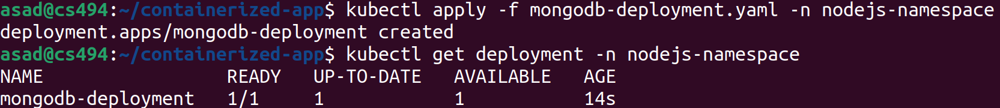

# Deploying Containerized Nodejs, MongoExpress, MongoDb Application 

In this demo application, we are going to deploy a **containerized** 3-Tier **Nodejs** web application with **MongoDB** and **Mongo-Express** on Kubernetes.

Application credit to [Nana Janashia](https://gitlab.com/nanuchi/developing-with-docker).

This application contains following tiers: 
1. `index.html` with pure js and css styles
2. `nodejs` backend with express module
3. `mongodb` for data storage

# Application Deployment Steps
Following steps are being followed to containerd the applicaiton and deployed on Minikube/Kubernetes. 

## Step 01: Create Own Namespace 
As application has 3-tiers, so each tier will be deployed as a separate Pod. And Pods work under some namespaces. We are going to create our own namespace, i.e. `nodejs-namespace` , to deploy all our Pods. 

To create the namespace, we are going to use following contents for manifest file, i.e. `nodejs-namespace.yaml`. 

```
apiVersion: v1
kind: Namespace
metadata:
  name: nodejs-namespace
```

### Run the command 
Now run the following command to have it in the K8s environment. 

`kubectl apply -f nodejs-namespace.yaml`


## Step 02: Create ConfigMap Manifest file
ConfigMap is used to maintain all the configuration details for different components. 

Since mongodb and mongo-express need some environment variables, we'll keep all those non-sensitive details in our configmap. 

Create a file `mongo-configmap.yaml` with following contents. 

```
apiVersion: v1
kind: ConfigMap
metadata:
  name: mongodb-configmap
  namespace: nodejs-namespace
data:
  database_url: mongodb-service
```

### Run the command 
Now run the following command to create the configmap under our namespace. 

`kubectl apply -f mongo-configmap.yaml -n nodejs-namespace`


## Step 03: Create Secret Manifest file
Secret is used to maintain all the **secret** configuration details for different components. 

Since mongodb and mongo-express environment variable for password so we'll keep this sensitive info in secret. 

Create a file `mongo-secret.yaml` with following contents. 

```
apiVersion: v1
kind: Secret
metadata:
  name: mongodb-secret
  namespace: nodejs-namespace
type: Opaque 
data:
  mongo-root-username: YWRtaW4=
  mongo-root-password: cGFzc3dvcmQ=
```

**Note:** In the secret manifest file `username` and `password` are not placed as plaintext, rather these items are transformed into non-readable format using `base64` algorithm. 

### Run the command 
Now run the following command to create the secret under our namespace. 

`kubectl apply -f mongo-secret.yaml -n nodejs-namespace`


## Step 04: Create Deployment Manifest file for MongoDB
In this step we are going to create a deployment manifest file to execute MongoDB container at port `27017`. Official docker image of [mongodb](https://hub.docker.com/_/mongo) is being used with `latest` tag.  

Create a `mongodb-deployment.yaml` file with following contents. 

```
apiVersion: apps/v1
kind: Deployment
metadata:
  name: mongodb-deployment
  namespace: nodejs-namespace
spec:
  replicas: 1
  selector:
    matchLabels:
      app: mongodb
  template:
    metadata:
      labels:
        app: mongodb
    spec:
      containers:
      - name: mongodb
        image: mongo:latest
        
        env:
        - name: MONGO_INITDB_ROOT_USERNAME
          valueFrom:
            secretKeyRef:
              name: mongodb-secret
              key: mongo-root-username
        - name: MONGO_INITDB_ROOT_PASSWORD
          valueFrom:
            secretKeyRef:
              name: mongodb-secret
              key: mongo-root-password
        ports:
        - containerPort: 27017
```

#### Environment Variables for MongoDB
When we start the mongo image, we can adjust the initialization of the MongoDB instance by passing one or more environment variables in the deployment file. 

Following are the two most important environment variables for the container:
- `MONGO_INITDB_ROOT_USERNAME`
- `MONGO_INITDB_ROOT_PASSWORD`

**Note:** These variables, used in conjunction, create a new user and set that user's password. This user is created in the admin authentication database and given the role of root, which is a "superuser" role. 

### Run the command 
Now run the following command to create the deployment under our namespace. 

`kubectl apply -f mongodb-deployment.yaml -n nodejs-namespace`



## Step 05: Create Service Manifest file for MongoDB
Up till now our mongodb is running but we want it to be accessible by other applications. Service is a concept which helps us in this regards. There are different types of services in K8s for different use-cases. 
1. ClusterIP
2. NodePort 
3. LoadBalancer 
4. Headless

For our use-case, `ClusterIP` service is suitable because it exposes the resource within the cluster of k8s. We also want to expose the MongoDB within the cluster so that only `mongo-express` and `nodejs app` can access it. 

Create a `mongodb-service.yaml` file with following contents. 

```
apiVersion: v1
kind: Service
metadata:
  name: mongodb-service
  namespace: nodejs-namespace
spec:
  type: ClusterIP
  selector:
    app: mongodb
  ports:
  - port: 27017
    protocol: TCP
    targetPort: 27017
```

### Run the command 
Now run the following command to create the service to expose the `mongodb` under our namespace. 

`kubectl apply -f mongodb-service.yaml -n nodejs-namespace`


**Congratulations!** 1st tier of our application is up now. 

## Step 06: Create Deployment Manifest file for Mongo-Express
Now it is time to move towards our next tier deployment, i.e. Mongo-Express. Mongo-express is a web-based MongoDB admin interface written in Node.js, Express.js, and Bootstrap3.

Let us create a deployment manifest file to execute Mongo-Express container at port `8081`. Official docker image of [mongo-express](https://hub.docker.com/_/mongo-express) is being used with `latest` tag.  

Create a `mongo-express-deployment.yaml` file with following contents. 

```
apiVersion: apps/v1
kind: Deployment
metadata:
  name: mongo-express-deployment
  namespace: nodejs-namespace
spec:
  selector:
    matchLabels:
      app: mongo-express
  template:
    metadata:
      labels:
        app: mongo-express
    spec:
      containers:
      - name: mongo-express
        image: mongo-express
        env:
          - name: ME_CONFIG_MONGODB_ADMINUSERNAME
            valueFrom:
              secretKeyRef:
                name: mongodb-secret
                key: mongo-root-username
          - name: ME_CONFIG_MONGODB_ADMINPASSWORD
            valueFrom:
              secretKeyRef:
                name: mongodb-secret
                key: mongo-root-password
          - name: ME_CONFIG_MONGODB_SERVER
            valueFrom:
              configMapKeyRef:
                name: mongodb-configmap
                key: database_url
        ports:
        - containerPort: 8081
```

#### Environment Variables for Mongo-Express
We start the mongo-express instance by passing some environment variables in the deployment file. 

Following are the most important environment variables for the `mongo-express` container:
- `ME_CONFIG_MONGODB_ADMINUSERNAME`: Here we need to provide the **admin username** of the mongodb. Value of this env variable will be get from configmap. 
- `ME_CONFIG_MONGODB_ADMINPASSWORD`: Here we need to provide the **admin password** of the mongodb. Value of this env variable will be get from configmap.
- `ME_CONFIG_MONGODB_SERVER`: Here we need to provide the **service name** of the mongodb. Value of this env variable will be get from configmap.

### Run the command 
Now run the following command to create the deployment under our namespace. 

`kubectl apply -f mongo-express-deployment.yaml -n nodejs-namespace`


## Step 07: Create Service Manifest file for Mongo-Express
Now it is time to expose the service for mongo-express, to make it accessible by everyone. 

For our use-case, `LoadBalancer` service is suitable because it exposes the resource outside the cluster of k8s. We'll expose the mongo-express service on a specific port so that any user can access it via browser at a provided port. 

Create a `mongodb-service.yaml` file with following contents. 

```
apiVersion: v1
kind: Service
metadata:
  name: mongodb-service
  namespace: nodejs-namespace
spec:
  type: ClusterIP
  selector:
    app: mongodb
  ports:
  - port: 27017
    protocol: TCP
    targetPort: 27017
```

### Run the command 
Now run the following command to create the service to expose the `mongodb` under our namespace. 

`kubectl apply -f mongodb-service.yaml -n nodejs-namespace`


**Congratulations!** 1st tier of our application is up now. 